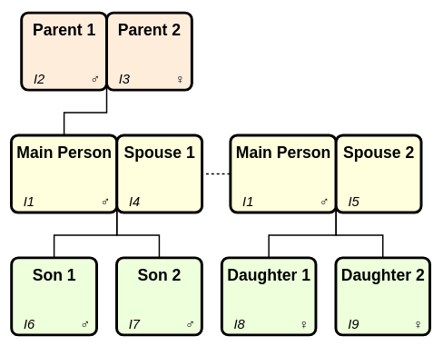

# Finding related records

## Introduction

We can find records using the family of `get_*()` functions. Most of
these are about finding familial relations to an individual.

We illustrate their functionality using the family below consisting of
three generations: A pair of parents who has a single child (named ‘Main
Person’). This person forms two separate family groups with two spouses,
each resulting in two children.

``` r
library(gedcomS7)

main_person <- IndividualRecord(pers_names = "Main Person", sex = "M")

three_gen <- new_gedcom() |> 
  push_record(main_person) |> 
  add_parents("@I1@", fath_name = "Parent 1", moth_name = "Parent 2") |> 
  add_spouse("@I1@", spou_name = "Spouse 1") |> 
  add_spouse("@I1@", spou_name = "Spouse 2") |> 
  add_children("@F2@", sexes = "MM", chil_names = c("Son 1", "Son 2")) |> 
  add_children("@F3@", sexes = "FF", chil_names = c("Daughter 1", "Daughter 2")) 
#> New Individual record added with xref @I1@
#> New Family record added with xref @F1@
#> New Individual record added with xref @I2@
#> New Individual record added with xref @I3@
#> New Individual record added with xref @I4@
#> New Family record added with xref @F2@
#> New Individual record added with xref @I5@
#> New Family record added with xref @F3@
#> New Individual record added with xref @I6@
#> New Individual record added with xref @I7@
#> New Individual record added with xref @I8@
#> New Individual record added with xref @I9@
```



Image courtesy of [Topola Genealogy
Viewer](https://pewu.github.io/topola-viewer) (a great tool for
visualising GEDCOM files!)

## Immediate relations

The examples below illustrate the functions. All the functions return
xrefs, so a helper function is created to convert xrefs for Individual
records into the people’s names.

``` r
main_person <- "@I1@"

# Helper to convert xrefs to names
xref_to_name <- \(x) unlist(lapply(x, \(xref) pull_record(three_gen, xref)@PRIMARY_NAME))

get_indi_partners(three_gen, main_person) |> xref_to_name()
#> [1] "Spouse 1" "Spouse 2"

get_indi_parents(three_gen, main_person) |> xref_to_name()
#> [1] "Parent 1" "Parent 2"

get_indi_children(three_gen, main_person) |> xref_to_name()
#> [1] "Son 1"      "Son 2"      "Daughter 1" "Daughter 2"

get_indi_siblings(three_gen, "@I6@") |> xref_to_name()
#> [1] "Son 2"

get_indi_siblings(three_gen, "@I6@", inc_half = TRUE) |> xref_to_name()
#> [1] "Son 2"      "Daughter 1" "Daughter 2"

get_fam_as_child(three_gen, main_person)
#> [1] "@F1@"

get_fam_as_spouse(three_gen, main_person)
#> [1] "@F2@" "@F3@"

get_fam_partners(three_gen, "@F1@")
#> [1] "@I2@" "@I3@"

get_fam_children(three_gen, "@F2@")
#> [1] "@I6@" "@I7@"
```

Many functions include a `pedigrees` parameter which allows you to
specify the types of relationships allowed (all are allowed by default,
specify “BIRTH” if you only want biological). Allowed values for
pedigrees are below.

``` r
unname(val_pedigree_types())
#> [1] "BIRTH"   "ADOPTED" "FOSTER"  "SEALING" "OTHER"
```

If we add an adopted child to family “@F3@” we can see the difference
this parameter makes:

``` r
adopted_child <- IndividualRecord(
  pers_names = "Adopted child",
  fam_links_chil = FamilyLinkChild(fam_xref = "@F3@", pedigree = "ADOPTED")
)

three_gen <- push_record(three_gen, adopted_child)
#> New Individual record added with xref @I10@

get_fam_children(three_gen, "@F3@") |> xref_to_name()
#> [1] "Daughter 1"    "Daughter 2"    "Adopted child"
get_fam_children(three_gen, "@F3@", pedigrees = "BIRTH") |> xref_to_name()
#> [1] "Daughter 1" "Daughter 2"
get_fam_children(three_gen, "@F3@", pedigrees = "ADOPTED") |> xref_to_name()
#> [1] "Adopted child"
```

## Distant relations

One of the more sophisticated features of `gedcomS7` is the ability to
manipulate entire branches of your tree.

We can use the
[`get_descendants()`](https://jl5000.github.io/gedcomS7/reference/get_descendants.md)
function to identify the descendants of Main Person. By default it will
exclude the individual, all spouses, and all associated family records:

``` r
get_descendants(three_gen, "@I2@") # Parent 1
#> [1] "@I1@"  "@I6@"  "@I7@"  "@I8@"  "@I9@"  "@I10@"
```

Setting `inc_part = TRUE` will include all partners and their
descendants, and all descendants’ partners:

``` r
get_descendants(three_gen, "@I2@", inc_part = TRUE)
#> [1] "@I3@"  "@I4@"  "@I5@"  "@I1@"  "@I6@"  "@I7@"  "@I8@"  "@I9@"  "@I10@"
```

Setting `inc_indi = TRUE` will include the individual:

``` r
get_descendants(three_gen, "@I2@", inc_indi = TRUE)
#> [1] "@I2@"  "@I1@"  "@I6@"  "@I7@"  "@I8@"  "@I9@"  "@I10@"
```

Setting `inc_fam = TRUE` will include the individual’s families where
they are a spouse/child, and all descendants’ families:

``` r
get_descendants(three_gen, "@I2@", inc_fam = TRUE)
#> [1] "@F1@"  "@F2@"  "@F3@"  "@I1@"  "@I6@"  "@I7@"  "@I8@"  "@I9@"  "@I10@"
```

We can deal with ancestors in a similar way using the
[`get_ancestors()`](https://jl5000.github.io/gedcomS7/reference/get_ancestors.md)
function. There is also a
[`get_indi_cousins()`](https://jl5000.github.io/gedcomS7/reference/get_indi_cousins.md)
function which allows you to find all types of cousin for an individual.

## Supporting records

Whilst the functions above focus on Individual and Family records, the
[`get_supporting_recs()`](https://jl5000.github.io/gedcomS7/reference/get_supporting_recs.md)
function identifies all other types of records referenced by a set of
records.

For example, below we create three different types of supporting record;
media, repository, and source. The source record is linked to both the
media and repository record.

We then add a link to the source record in the record of Main Person.

``` r
supporting_media <- MediaRecord(
  files = MediaFile("myfile.mp3", media_type = "audio/mp3")
  )
supporting_repo <- RepositoryRecord(repo_name = "Library")
# Source record is itself linked to the Media and Repository records
supporting_sour <- SourceRecord(
  media_links = three_gen@records@XREFS_NEXT["OBJE"],
  repo_citations = three_gen@records@XREFS_NEXT["REPO"]
)

three_gen <- three_gen |> 
  push_record(supporting_media) |> 
  push_record(supporting_repo) |> 
  push_record(supporting_sour)
#> New Multimedia record added with xref @M1@
#> New Repository record added with xref @R1@
#> New Source record added with xref @S1@

# Pull Main Person so we can add a link to the new source record
main_person <- pull_record(three_gen, "@I1@")
main_person@citations <- "@S1@"
three_gen <- push_record(three_gen, main_person)
```

Now, when we get the supporting records, it not only retrieves the
record directly referenced in Main Person’s record, but also recognises
the downstream dependencies of the repository and media records.

``` r
get_supporting_recs(three_gen, "@I1@")
#> [1] "@S1@" "@R1@" "@M1@"
```

## Pattern matching

Finally, the
[`get_records_by_pattern()`](https://jl5000.github.io/gedcomS7/reference/get_records_by_pattern.md)
function retrieves all records where a value matches a given regular
expression (case insensitive).

``` r
get_records_by_pattern(three_gen, "library")
#> [1] "@R1@"
get_records_by_pattern(three_gen, "son")
#> [1] "@I1@" "@I6@" "@I7@"
```

By default, this returns the xrefs only. If you want to see why the
records were matched, set `return_context = TRUE` and it will return all
the lines where a match occurred:

``` r
get_records_by_pattern(three_gen, "son", return_context = TRUE)
#> $`@I1@`
#> [1] "1 NAME Main Person"
#> 
#> $`@I6@`
#> [1] "1 NAME Son 1"
#> 
#> $`@I7@`
#> [1] "1 NAME Son 2"
```

You can then refine your pattern to include word boundaries etc.

``` r
get_records_by_pattern(three_gen, "\\bson\\b", return_context = TRUE)
#> $`@I6@`
#> [1] "1 NAME Son 1"
#> 
#> $`@I7@`
#> [1] "1 NAME Son 2"
```
