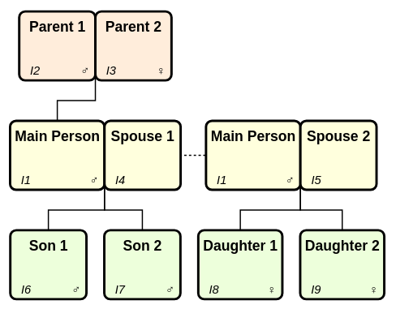

```{r, include = FALSE}
knitr::opts_chunk$set(
  collapse = TRUE,
  comment = "#>"
)
```

## Introduction

We can find records using the family of `get_*()` functions. Most of these are about finding familial relations to an individual.

We illustrate their functionality using the family below consisting of three generations: A pair of parents who has a single child (named 'Main Person'). This person forms two separate family groups with two spouses, each resulting in two children.

```{r, warning=FALSE}
library(gedcomS7)

main_person <- IndividualRecord(pers_names = "Main Person", sex = "M")

three_gen <- new_gedcom() |> 
  push_record(main_person) |> 
  # Parents are @I2@ and @I3@ in family @F1@
  add_parents("@I1@", fath_name = "Parent 1", moth_name = "Parent 2") |> 
  # Spouse one is @I4@ in family @F2@
  add_spouse("@I1@", spou_name = "Spouse 1") |> 
  # Spouse two is @I5@ in family @F3@
  add_spouse("@I1@", spou_name = "Spouse 2") |> 
  # Sons are @I6@ and @I7@
  add_children("@F2@", sexes = "MM", chil_names = c("Son 1", "Son 2")) |> 
  # Daughters are @I8@ and @I9@
  add_children("@F3@", sexes = "FF", chil_names = c("Daughter 1", "Daughter 2")) 
```


Image courtesy of [Topola Genealogy Viewer](https://pewu.github.io/topola-viewer) (a great tool for visualising GEDCOM files!)

## Immediate relations

The examples below illustrate the functions. All the functions return xrefs, so a helper function is created to convert xrefs for Individual records into the people's names.

```{r, warning=FALSE}
main_person <- "@I1@"

# Helper to convert xrefs to names
xref_to_name <- \(x) unlist(lapply(x, \(xref) pull_record(three_gen, xref)@PRIMARY_NAME))

get_indi_partners(three_gen, main_person) |> xref_to_name()
get_indi_parents(three_gen, main_person) |> xref_to_name()
get_indi_children(three_gen, main_person) |> xref_to_name()
get_indi_siblings(three_gen, "@I6@") |> xref_to_name()
get_indi_siblings(three_gen, "@I6@", inc_half = TRUE) |> xref_to_name()
get_fam_as_child(three_gen, main_person)
get_fam_as_spouse(three_gen, main_person)
get_fam_partners(three_gen, "@F1@")
get_fam_children(three_gen, "@F2@")
```

Many functions include a `pedigrees` parameter which allows you to specify the types of relationships allowed (all are allowed by default, specify "BIRTH" if you only want biological). Allowed values for pedigrees are below.

```{r}
unname(val_pedigree_types())
```

If we add an adopted child to family "@F3@" we can see the difference this parameter makes:

```{r, warning=FALSE}
adopted_child <- IndividualRecord(
  pers_names = "Adopted child",
  fam_links_chil = FamilyLinkChild(fam_xref = "@F3@", pedigree = "ADOPTED")
)

three_gen <- push_record(three_gen, adopted_child)

get_fam_children(three_gen, "@F3@") |> xref_to_name()
get_fam_children(three_gen, "@F3@", pedigrees = "BIRTH") |> xref_to_name()
get_fam_children(three_gen, "@F3@", pedigrees = "ADOPTED") |> xref_to_name()
```

## Branches

One of the more sophisticated features of `gedcomS7` is the ability to manipulate entire branches of your tree. 

We can use the `get_descendants()` function to identify the descendants of Main Person. By default it will exclude the individual, all spouses, and all associated family records:

```{r}
get_descendants(three_gen, "@I2@") # Parent 1
```

Setting `inc_part = TRUE` will include all partners and their descendants, and all descendants' partners:

```{r}
get_descendants(three_gen, "@I2@", inc_part = TRUE)
```

Setting `inc_indi = TRUE` will include the individual:

```{r}
get_descendants(three_gen, "@I2@", inc_indi = TRUE)
```

Setting `inc_fam = TRUE` will include the individual's families where they are a spouse/child, and all descendants' families:

```{r}
get_descendants(three_gen, "@I2@", inc_fam = TRUE)
```

We can deal with ancestors in a similar way using the `get_ancestors()` function. There is also a `get_indi_cousins()` function which allows you to find all types of cousin for an individual.

## Supporting records

Whilst the functions above focus on Individual and Family records, the `get_supporting_recs()` function identifies all other types of records referenced by a set of records.

For example, below we create three different types of supporting record; media, repository, and source. The source record is linked to both the media and repository record.

We then add a link to the source record in the record of Main Person.

```{r, warning=FALSE}
supporting_media <- MediaRecord(
  files = MediaFile("myfile.mp3", media_type = "audio/mp3")
  )
supporting_repo <- RepositoryRecord(repo_name = "Library")
# Source record is itself linked to the Media and Repository records
# (they don't have these xrefs yet but they will be assigned them when pushed)
supporting_sour <- SourceRecord(
  media_links = "@M1@",
  repo_citations = "@R1@"
)

three_gen <- three_gen |> 
  push_record(supporting_media) |> 
  push_record(supporting_repo) |> 
  push_record(supporting_sour)

# Pull Main Person so we can add a link to the new source record
main_person <- pull_record(three_gen, "@I1@")
main_person@citations <- "@S1@"
three_gen <- push_record(three_gen, main_person)
```

Now, when we get the supporting records, it not only retrieves the record directly referenced in Main Person's record, but also recognises the downstream dependencies of the repository and media records.

```{r}
get_supporting_recs(three_gen, "@I1@")
```
